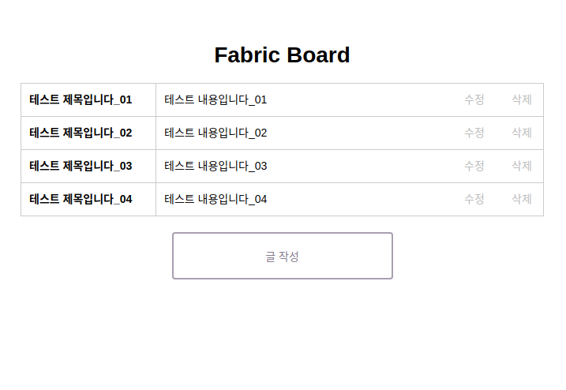

## 작업환경 구성

#### 01.설치 및 환경 설정

fabric-board 다운로드

```
git clone https://github.com/chosung-dev/fabric_board
```

fabric-samples 디렉토리에 hyperledger/fabric/basic-network(https://github.com/chosung-dev/fabric_board/basic-network) 디렉토리를 복사해서 집어넣는다. 
설치된 최종 디렉토리 경로는 `fabric_board/fabric-samples/basic-network`이다.

basic-network/docker-compose.yml 파일을 다음과 같이 수정

 -변경전

```
service.cli.volume:
		- ./../chaincode/:/opt/gopath/src/github.com/
```

 -변경후

```
service.cli.volume:
		- ./../../chaincode/:/opt/gopath/src/github.com/
```


#### 02.컨테이너 생성 및 서버 오픈

startFabric.sh를 통해 컨테이너 생성 및 체인코드 입력.

```
./startFabric.sh
```

다음과 같은 컨테이너를 확인 할 수 있다.

```
CONTAINER ID        IMAGE                        COMMAND                  CREATED             STATUS              PORTS                                            NAMES
8a13ad4662d4        hyperledger/fabric-tools     "/bin/bash"              2 minutes ago       Up 2 minutes                                                         cli
2deddbb21717        hyperledger/fabric-peer      "peer node start"        2 minutes ago       Up 2 minutes        0.0.0.0:7051->7051/tcp, 0.0.0.0:7053->7053/tcp   peer0.org1.example.com
1de6ccc4c52e        hyperledger/fabric-ca        "sh -c 'fabric-ca-se…"   2 minutes ago       Up 2 minutes        0.0.0.0:7054->7054/tcp                           ca.example.com
98bd051eb96f        hyperledger/fabric-couchdb   "tini -- /docker-ent…"   2 minutes ago       Up 2 minutes        4369/tcp, 9100/tcp, 0.0.0.0:5984->5984/tcp       couchdb
3f5675763f7e        hyperledger/fabric-orderer   "orderer"                2 minutes ago       Up 2 minutes        0.0.0.0:7050->7050/tcp                           orderer.example.com
```

npm install 진행

```
npm install
```

fabric_board/bin/www 실행하여 http://localhost:3000 접속 확인.


