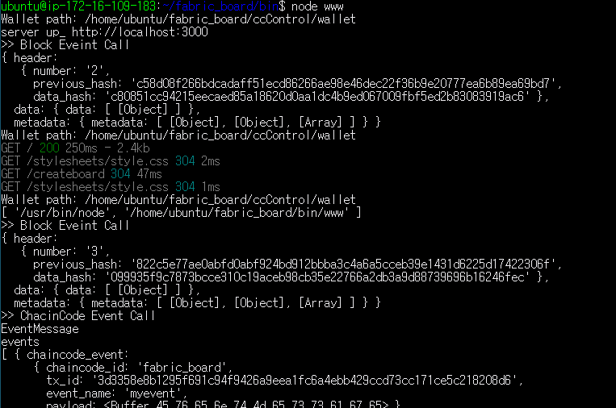

## 작업환경 구성

#### 01.작업환경

```
fabric ver 1.4.1
node ver 8.10.0
docker ver 18.09.5
```

#### 02.컨테이너 생성 및 서버 오픈

startFabric.sh를 통해 컨테이너 생성 및 체인코드 입력.

```
./startFabric.sh
```

다음과 같은 컨테이너를 확인 할 수 있다.

```
CONTAINER ID        IMAGE                                                                                                          COMMAND                  CREATED             STATUS              PORTS                                              NAMES
81fc9ac8324f        dev-peer0.org1.example.com-fabric_board-1.0-47efc121b52d2ddebdf3614a86156e23d4fcba28e8b83a3ad4b5d40389c2abf8   "chaincode -peer.add…"   3 hours ago         Up 3 hours                                                             dev-peer0.org1.example.com-fabric_board-1.0
c12168dbc102        hyperledger/fabric-tools                                                                                       "/bin/bash"              3 hours ago         Up 3 hours                                                             cli
609aefb3ecfc        hyperledger/fabric-peer                                                                                        "peer node start"        3 hours ago         Up 3 hours          0.0.0.0:37051->7051/tcp, 0.0.0.0:37053->7053/tcp   peer0.org3.example.com
8a94ef64b737        hyperledger/fabric-peer                                                                                        "peer node start"        3 hours ago         Up 3 hours          0.0.0.0:17051->7051/tcp, 0.0.0.0:17053->7053/tcp   peer0.org1.example.com
eb572d787a7a        hyperledger/fabric-ca                                                                                          "sh -c 'fabric-ca-se…"   3 hours ago         Up 3 hours          0.0.0.0:37054->7054/tcp                            ca.org3.example.com
5f680a8a0804        hyperledger/fabric-ca                                                                                          "sh -c 'fabric-ca-se…"   3 hours ago         Up 3 hours          0.0.0.0:17054->7054/tcp                            ca.org1.example.com
8827913b8450        hyperledger/fabric-orderer                                                                                     "orderer"                3 hours ago         Up 3 hours          0.0.0.0:7050->7050/tcp                             orderer.example.com
15b4650d5da0        hyperledger/fabric-couchdb                                                                                     "tini -- /docker-ent…"   3 hours ago         Up 3 hours          4369/tcp, 9100/tcp, 0.0.0.0:5984->5984/tcp         couchdb0
ad6dadc759b9        hyperledger/fabric-couchdb                                                                                     "tini -- /docker-ent…"   3 hours ago         Up 3 hours          4369/tcp, 9100/tcp, 0.0.0.0:6984->5984/tcp         couchdb1

```

npm install 진행

```
npm install
```

fabric_board/bin/www 실행하여 http://localhost:3000 접속 확인.
```
cd bin
node www
```



스위치를 이용, org3로 변경 후 화면 (첫 시도 시 시간이 걸릴 수 있습니다.)


